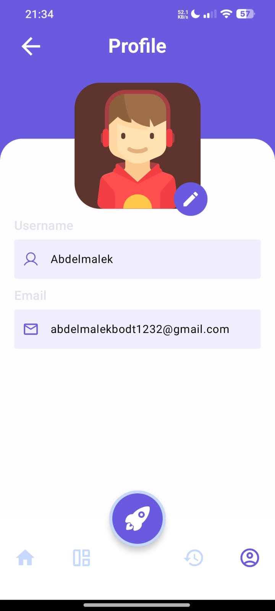
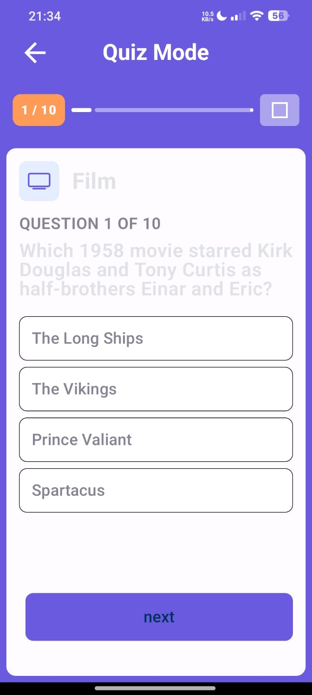
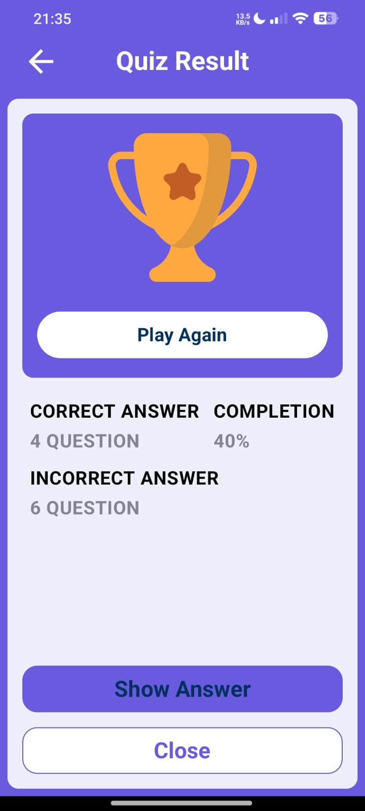

# Quiz Application


## Overview

Quiz Application is an Android-based app that allows users to take quizzes on various topics. The app fetches quiz data from an API and presents it to the user in a fun and interactive manner. Users can select the number of questions, category, difficulty, and type of questions they want to answer.

## Features

- Fetches quiz questions dynamically from an API.
- Customizable quiz options: amount of questions, category, difficulty, and question type.
- Real-time scoring system.
- Clean and user-friendly interface built with **Jetpack Compose**.
- Supports multiple quiz categories.

## Screenshots

Here are some screenshots of the application:

<p align="center">
    
    
    
    
    
</p>


## Technologies Used

- **Kotlin**: Main programming language.
- **Jetpack Compose**: UI toolkit for building native Android apps.
- **Retrofit**: For handling network requests and API integration.
- **Coroutines**: For managing background threads and asynchronous programming.
- **ViewModel**: For managing UI-related data in a lifecycle-conscious way.
- **KOIN**: For dependency injection.

## Architecture

The application follows the **MVVM** (Model-View-ViewModel) architecture pattern:

- **Model**: Responsible for managing the app's data (e.g., fetching data from the quiz API).
- **View**: The UI layer displaying the data to the user.
- **ViewModel**: Acts as a bridge between the Model and View, ensuring the separation of concerns.

## How to Run the Project

1. **Clone the repository**:
   ```bash
   git clone https://github.com/AbdelmalekMokhtar/quizapp.git
